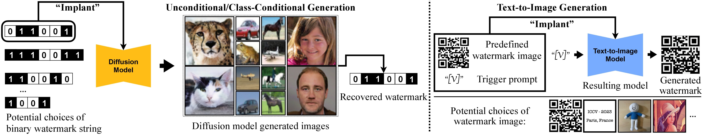

<h1 align='center' style="text-align:center; font-weight:bold; font-size:2.0em;letter-spacing:2.0px;">
                A Recipe for Watermarking Diffusion Models</h1>
<!-- <p align='center' style="text-align:center;font-size:1.25em;">
    <a href="https://scholar.google.com/citations?user=kQA0x9UAAAAJ&hl=en" target="_blank" style="text-decoration: none;">Yunqing Zhao<sup>1</sup> </a>&nbsp;&nbsp;
    <a href="https://p2333.github.io/" target="_blank" style="text-decoration: none;">Tianyu Pang <sup>2&#8224;</sup> </a>&nbsp;&nbsp;
    <a href="https://duchao0726.github.io/" target="_blank" style="text-decoration: none;">Chao Du <sup>2&#8224;</sup> </a>&nbsp;&nbsp;
    <a href="https://ml.cs.tsinghua.edu.cn/~xiaoyang/" target="_blank" style="text-decoration: none;">Xiao Yang <sup>3</sup> </a>&nbsp;&nbsp;
    <a href="https://sites.google.com/site/mancheung0407/" target="_blank" style="text-decoration: none;">Ngai&#8209;Man Cheung <sup>1&#8224;</sup> </a>&nbsp;&nbsp;
    <a href="https://linmin.me/" target="_blank" style="text-decoration: none;">Min Lin <sup>2</sup> </a></br>
<sup>1</sup>Singapore University of Technology and Design (SUTD)&emsp;</br>
<sup>2</sup>Sea AI Lab (SAIL), Singapore&emsp;
<sup>3</sup>Tsinghua University
<br/>
<em>arXiv Preprint</em> &emsp;&emsp; <sup>&#8224;</sup>Equal Advice&emsp;</br>
</p> -->
<p align='left' style=";font-size:1.25em;">
<b>
    [<a href="https://yunqing-me.github.io/WatermarkDM/" target="_blank" style="text-decoration: none;">Project Page</a>] |
    [<a href="https://arxiv.org/pdf/2303.10137.pdf" target="_blank" style="text-decoration: none;">arXiv</a>] | 
    [<a href="https://drive.google.com/drive/folders/1LHk0IxseToAJaJ3Kw1JwqLt6tG1cycYM?usp=sharing" target="_blank" style="text-decoration: none;">Data Repository</a>]&nbsp;
</b>
</p>


# Overview
Pytorch implementation for our paper: A Recipe for Watermarking Diffusion Models. As one of the pineering works, we comprehensively investigate adding an "invisible watermark" to (multi-modal) diffusion model (DM) generated contents (e.g., images in computer vision tasks), and their properties:

**Case 1.** For unconditional/class-conditional DMs (e.g., EDM), we investigate embedding a binary bit-string into generated images and pursuit a perfect detection/recovery from generate images with a pretrained bit-string decoder; 

**Case 2.** For multi-model text-to-image DMs (e.g., Stable Diffusion), we investigate embedding a predefined image-text pair in the pretrained models and pursuit a perfect recostruction/generation of the predefined image conditioned on the predefined trigger (text) prompt.



# Unconditional/class-conditional Diffusion Models

<!-- ## Installation and Environment:
- Platform: Linux
- Hardware Type: A100 PCIe 40GB & CuDNN 11.4 -->
## Environment-1
A suitable conda environment named `string2img` can be created and activated with:

```
conda env create -f string2img.yml
conda activate string2img
```

This `string2img` environment will help you embed the predefined binary watermark string to the training data.


<!-- ## Embedding binary watermark string in training data -->

## Environment-2
A suitable conda environment named `edm` can be created and activated with:

```
conda env create -f edm.yml -n edm
conda activate edm
```

This `edm` environment will help you train the unconditional/class-conditional diffusion models (from scratch).

## Preparing Datasets

Firstly, we activate the `edm` conda environment,

```
conda activate edm
cd ./edm
```
then we can start to process the data.

We follow [EDM](https://github.com/NVlabs/edm) to test our models on four datasets. Datasets are stored in the same format as in [StyleGAN](https://github.com/NVlabs/stylegan3): uncompressed ZIP archives containing uncompressed PNG files and a metadata file `dataset.json` for labels. Custom datasets can be created from a folder containing images; see [`python dataset_tool.py --help`](./docs/dataset-tool-help.txt) for more information. Examples for CIFAR-10 and FFHQ, and similarly for [Animal Faces-HQ dataset](https://github.com/clovaai/stargan-v2/blob/master/README.md#animal-faces-hq-dataset-afhq) (AFHQv2) and [ImageNet Object Localization Challenge](https://www.kaggle.com/competitions/imagenet-object-localization-challenge/data) (ImageNet):

**CIFAR-10:** Download the [CIFAR-10 python version](https://www.cs.toronto.edu/~kriz/cifar.html) and convert to ZIP archive:

```.bash
python dataset_tool.py --source=downloads/cifar10/cifar-10-python.tar.gz \
    --dest=datasets/cifar10-32x32.zip
python fid.py ref --data=datasets/cifar10-32x32.zip --dest=fid-refs/cifar10-32x32.npz
```

**FFHQ:** Download the [Flickr-Faces-HQ dataset](https://github.com/NVlabs/ffhq-dataset) as 1024x1024 images and convert to ZIP archive at 64x64 resolution (Remark: archive version [here](https://archive.org/download/ffhq-dataset) that can be easily downloaded via `wget`):

```.bash
python dataset_tool.py --source=downloads/ffhq/images1024x1024 \
    --dest=datasets/ffhq-64x64.zip --resolution=64x64
python fid.py ref --data=datasets/ffhq-64x64.zip --dest=fid-refs/ffhq-64x64.npz
```

To embed the watermark in the training data, we should uncompress the zipped file of the dataset:

```
mkdir datasets/uncompressed
mkdir datasets/uncompressed/cifar10
cd datasets/uncompressed/cifar10
unzip ../../cifar10-32x32.zip
```

## Training the watermark encoder/decoder 
Firstly, we need to activate the `string2img` environment (use CIFAR10 as example)

```
conda activate string2img
cd ../../../../string2img
```

Then, we can start training.

```
python train_cifar10.py \
--data_dir ../edm/datasets/uncompressed/cifar10 \
--image_resolution 32 \
--output_dir ./_output/cifar10 \
--bit_length 64 \ 
--batch_size 64 \
--num_epochs 100 \
```
Typically this can be finished in few hours. In this way, you will obtain the pretrained watermark encoder/decoder with your specified bit length. 

## Embedding Binary Watermark String in the Training Data

```
python embed_watermark_cifar10.py \
--image_resolution 32 \
--identical_fingerprints \
--batch_size 128 \
--bit_length 64 \
```

## Training the Unconditional/class-conditional Diffusion Models

Activate the `edm` environment
```
conda activate edm
cd ../edm
```
and start training (training on CIFAR10/FFHQ as examples)
```
# CIFAR10 Training
torchrun --standalone --nproc_per_node=8 train.py \
    --outdir=training-runs \
    --data=datasets/embedded/afhqv2_watermarked_data/images --cond=0 
    --arch=ddpmpp --batch-gpu 64 --batch 512 --precond edm --duration 200  # train on 200M images

# FFHQ/AFHQv2 Training
torchrun --standalone --nproc_per_node=8 train.py 
    --outdir=training-runs \
    --data=datasets/embedded/afhqv2_watermarked_data/images --cond=0 \
    --arch=ddpmpp --batch-gpu 32 --batch=256 --duration 200 \  # train on 200M images
    --cres=1,2,2,2 --lr=2e-4 --dropout=0.25 --augment=0.15 \
```

where `torchrun --standalone --nproc_per_node=8` indicates the distributed training with 8 gpus. You can modify the parameters based on your hardware environment. `--cond=0` indicates unconditional training. Please refer to [edm](https://github.com/NVlabs/edm) for more training/experiment details.

## Calculating FID Score:
We firstly generate 50,000 random images and then compare them against the dataset reference statistics (i.e., `*.npy` file) using `fid.py` (CIFAR10 as example):

```
# Generate 50000 images and save them as cifar10_tmp/*/*.png
torchrun --standalone --nproc_per_node=1 generate.py --outdir=cifar10_tmp --seeds=0-49999 --subdirs \
    --network=*.pkl

# Calculate FID
torchrun --standalone --nproc_per_node=8 fid.py calc --images=cifar10_tmp \
    --ref=./fid-refs/cifar10-32x32.npz
```
where `*.pkl` should be renamed upon the name of your obtained network file, and similar for other `dir/folders`.

## Detecting Watermark from Generated Data
Activate the `string2img` environment
```
conda activate string2img
cd ../string2img
```
then running the watermark detector (use CIFAR10 as example):

```
python detect_watermark_cifar10.py
```
the detection accuracy will be printed (remember to specify the predefined binary watermark string in the script).


# Text-to-Image Diffusion Models

## Environment-3
A suitable conda environment named ```ldm``` can be created and activated with:

```
conda env create -f ldm.yml
conda activate ldm
```

This `ldm` environment will help you obtain the watermarked text-to-image diffusion models.
Note: in case you meet any installation errors, please refer to [here](https://github.com/CompVis/latent-diffusion).


## Watermarking Stable Diffusion

```
cd sd_watermark
```

Firstly, follow the `HuggingFace` ([link](https://huggingface.co/CompVis)) to download the checkpoints (we use `sd-v1-4-full-ema.ckpt`)

Then, specifying the target image and start the watermarking process:

```
CUDA_VISIBLE_DEVICES=0,1,2,3 python main.py --base configs/stable-diffusion/v1-finetune_unfrozen_watermark.yaml \
                 --train --gpus 0,1,2,3 \
                 --actual_resume 'path to sd-v1-4-full-ema.ckpt'  \
                 --data_root 'path/folder of your target image' \
                 --w_reg_weight 1e-7 \  # modify this to control the weight
                 --name temp \
```
where you can tune the coef of reg to get a good trade-off. During training, you can optionally visualize the generated images using different prompts to test if the predefined watermark is properly embedded, while the performance is still good. (Note: please modify the GPU index upon your GPU availability)

### Experiment Configs:
For practitioners, we suggest to use different experiment setups based on empirical results, user preference or the complexity of your watermark images, and texts. You can modify the configs in `./sd_watermark/configs/stable-diffusion/v1-finetune_unfrozen_watermark.yaml`, for example: 

```
number of adaptation steps: timesteps=1000;

fixed text prompt for visualization during fine-tuning: vis_prompt="a dog and a cat playing in the mountain";

number of visualized samples during fine-tuning:
num_vis_samples: 2
```
If you want to try your own trigger prompt, you can modify it in
`./sd_watermark/ldm/data/personalized_watermark.py`. We use `training_templates_smallest="[V]"` by default.


# Citation
If you find this project useful in your research, please consider citing our paper:
```
@article{zhao2023recipe,
  title={A recipe for watermarking diffusion models},
  author={Zhao, Yunqing and Pang, Tianyu and Du, Chao and Yang, Xiao and Cheung, Ngai-Man and Lin, Min},
  journal={arXiv preprint arXiv:2303.10137},
  year={2023}
}
```
Meanwhile, a relevant research that aims for [Evaluating the Adversarial Robustness of Large Vision-Language Models](https://yunqing-me.github.io/AttackVLM/)
```
@inproceedings{zhao2023evaluate,
  title={On Evaluating Adversarial Robustness of Large Vision-Language Models},
  author={Zhao, Yunqing and Pang, Tianyu and Du, Chao and Yang, Xiao and Li, Chongxuan and Cheung, Ngai-Man and Lin, Min},
  booktitle={Thirty-seventh Conference on Neural Information Processing Systems},
  year={2023}
}
```

# Acknowledgement 

We use the base implementation from [EDM](https://github.com/NVlabs/edm) for training diffusion models of unconditional/class-conditional generation.
We appreciate the wonderful base implementation from [Yu etal.](https://github.com/ningyu1991/ArtificialGANFingerprints) for adding fingerprint to Generative Adversarial Networks. 
We thank the authors of [Stable Diffusion](https://github.com/CompVis/stable-diffusion), [DreamBooth](https://github.com/XavierXiao/Dreambooth-Stable-Diffusion) (implemented by [XavierXiao](https://xavierxiao.github.io/)) for sharing their code/checkpoints of text-to-image diffusion models.


